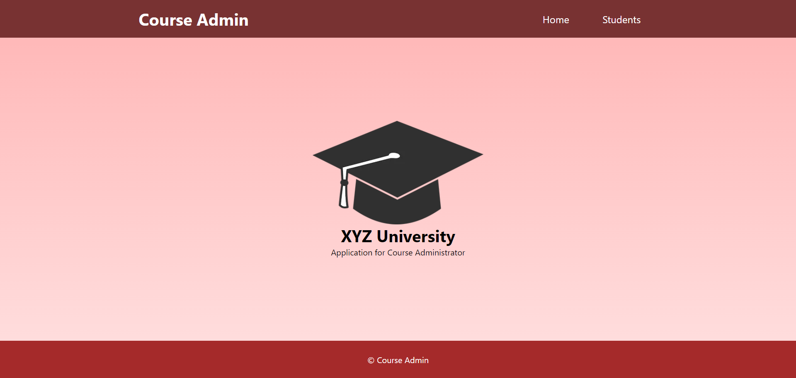
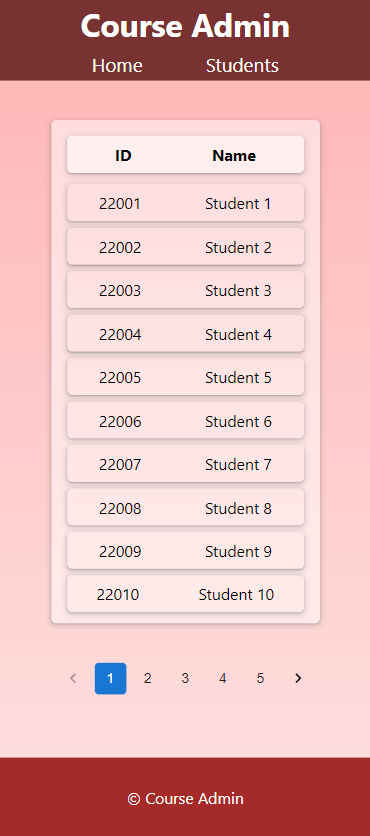
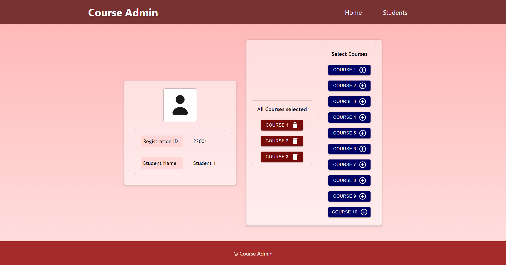
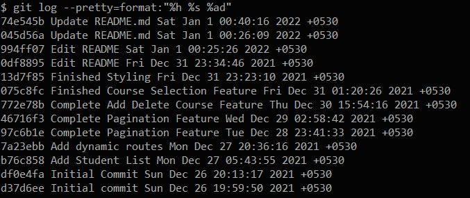

A simple application for an Admin in a University to manually choose courses for students. 

## Getting Started

First, run the Json-server:

```
$ cd server-api
```
```
server-api $ npm install
```
```
server-api $ npm start
```

To run the Course-Admin App:

```
$ cd course-admin
```
```
course-admin $ npm install
```
```
course-admin $ npm run dev
```

Open [http://localhost:3000](http://localhost:3000) with your browser to see the Course-Admin App.

Open [http://localhost:3001/students](http://localhost:3001/students) with your browser to see the database.

If you want to edit the database manually then directly edit the <b>db.json</b> file in the <b>server-api</b> directory.

<br><br>

___
## Technical Stack

This is a Next.js project.

- [Next.js](https://nextjs.org/)
- [React.js](https://reactjs.org/)
- [Node.js](https://nodejs.org/en/)
- [Json-Server](https://github.com/typicode/json-server)
- [Axios](https://axios-http.com/)

## Features

1.	Return the list of students, optionally with pagination
2.	Display the list of students
3.	Upon click on the list item, display the selected courses for that specific student
4.	Also, add the option to choose some courses for that student

## Additional Features

- [x] Application is responsive on mobile devices too
- [ ] Unit tests to your code
- [ ] Add Dockerfile and Docker Compose
- [ ] Authentication for the APIs

## Screenshots





## Commits


